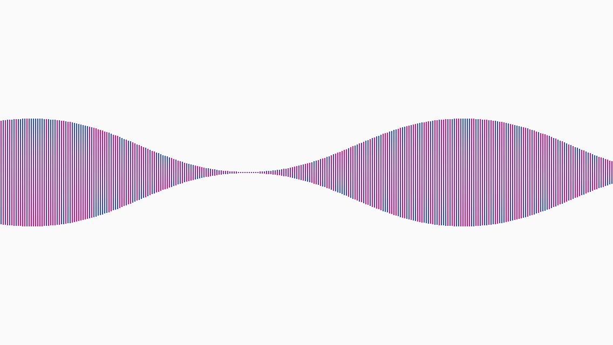
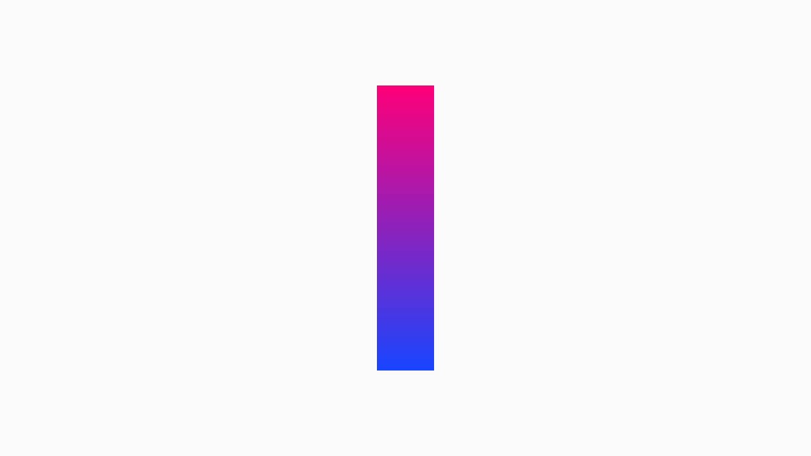

# Waves

In this section we're going to introduce you to an important concept in C4: Animations. We'll also show you how to work with gradients and timers to create a wave effect. When we're done, we'll show you how to tweak a single line of code to get some different aesthetics out of the example.

Here are some examples of the animation you'll be building:




Start by creating a new C4 project called Waves.

## Animations
In C4, you'll be working a lot with objects that contain properties. For example, all shapes have a `fillColor` and `strokeColor`. C4 lets you create animations by changing the properties of objects. Rather than calculating all the steps between `a` and `b`, you can focus on thinking about states. For example, the following snippet will create a 0.25 second animation where a circle's fill color will shift to red: 

```
C4ViewAnimation(duration: 0.25) {
    circle.fillColor = red
}
```

Now's a good time to check out the basics of animations and properties over at: [C4 Basics](http://www.c4ios.com/basics/)

##Gradients
For this section, we're going to create a wave of gradients by using a `for` loop and a timer to offset our animations. You can create a simple gradient by giving it a frame and a set of colors, like so:

```
override func setup() {
    let g = C4Gradient(frame: C4Rect(0,0,40,200), colors: [C4Pink,C4Blue])
    g.center = canvas.center
    canvas.add(g)
}
```




By default, the gradient draws from top to bottom of its frame. If you want to change that you can specify a new value for either its `startPoint` or `endPoint`.

By adding the following line to `setup()`:

```
g.endPoint = C4Point(1,1)
```

... the gradient will draw from its top-left corner to its bottom-right:


> Note: when setting the end points you do so with relative values. The corners of the gradient's frame are `{0,0}`, `{1,0}`, `{1,1}` and `{0,1}` read clockwise from the top-right.

##Timers
By default, there are no draw-loops in C4, which means that we can't trigger animations based on frame counts. But, there are a variety of techniques that we can use to offset the triggering of code. For example, we could use a `delay` that will execute a bit of code after a specified amount of time (measured in seconds).

```
delay(0.25) {
    //run a method
}
```

Delays are great for simple circumstances. You can tell the application to wait a quarter second before doing something. However, they become unreliable when you start chaining them together.

If you want a lot of animations to start at regular intervals, the easiest technique is to use a `C4Timer`. You create one by specifying an interval and a block of code to execute. For example, printing to the console once every quarter-second looks like this:

```
var timer: C4Timer!

override func setup() {
    timer = C4Timer(interval: 0.25) {
        print("Hello C4")
    }
    timer.start()
}
```

>NOTE: The timer has to be set as a variable **outside** the method in which you create it.

And, if you want to know how many times the timer has fired, you can do this:

```
var timer: C4Timer!

override func setup() {
    timer = C4Timer(interval: 0.25) {
        print("Hello C4: \(self.timer.step)")
    }
    timer.start()
}
```

>This will continuously print like so: `Hello C4: 1`,`Hello C4: 2`,`Hello C4: 3`,...

And, if you want to have the timer stop after a given number of iterations, you can do this:

```
var timer: C4Timer!

override func setup() {
    timer = C4Timer(interval: 0.25, count: 10) {
        print("Hello C4: \(self.timer.step)")
    }
    timer.start()
}
```
>This stops after the timer has fired 10x.

As you can see, timers are easy to work with and give you a range of flexibility in starting, stopping, and changing their parameters.

Now that we've had an overview of the 3 main components of this section, let's build it!

##The Wave
To create our wave we're going to follow this 4-step process:

1. Build a method that creates a gradient and adds it to the canvas
2. Use a `repeat` loop to create a lot of gradients
3. Build a method to customize an animation
4. Use a timer to initiates the animation for each gradient

###The Gradient Method
The main reason we want to have a method that creates our gradient is because we're going to call it over and over again. This step is easy, and nearly the same as above (except for some minor changes).

```
class WorkSpace: C4CanvasController {
    override func setup() {
        createGradient(canvas.center)
    }

    func createGradient(point: C4Point) -> C4Gradient {
        var colors = [C4Blue,C4Pink]

        if random(below: 2) == 1 {
            colors = [C4Pink,C4Blue]
        }

        let g = C4Gradient(frame: C4Rect(0,0,10.0,100.0), colors: colors)
        g.center = point
        canvas.add(g)
        return g
    }
}
```